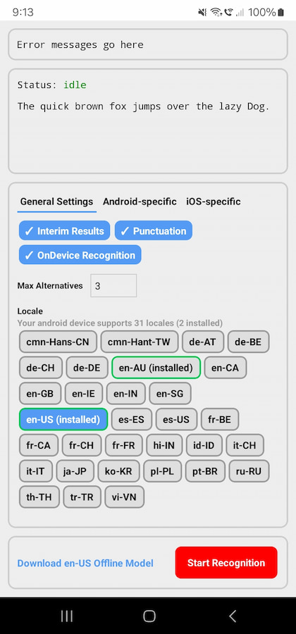

# 🎙️ expo-speech-recognition

expo-speech-recognition implements `SpeechRecognition` from the [Web Speech API](https://wicg.github.io/speech-api/) specification for React Native projects with the goal of code reuse across web and mobile.



## Installation

1. Install the package

```
npm install @jamsch/expo-speech-recognition
```

2. Configure the config plugin.

> The config plugin updates the Android App Manifest to include package visibility filtering for `com.google.android.googlequicksearchbox` (Google's Speech Recognition) along with the required permissions for Android and iOS.

```js
// app.json
{
  "expo": {
    "plugins": [
      [
        "@jamsch/expo-speech-recognition",
        {
          "microphonePermission": "Allow $(PRODUCT_NAME) to use the microphone.",
          "speechRecognitionPermission": "Allow $(PRODUCT_NAME) to use speech recognition.",
          // Add additional speech service packages here that aren't listed
          // under the `forceQueryable` section when running the command:
          // "adb shell dumpsys package queries"
          // default: ["com.google.android.googlequicksearchbox"]
          "androidSpeechServicePackages": ["com.google.android.googlequicksearchbox"]
        }
      ]
    ]
  }
}
```

## Usage

### Using Hooks

Using hooks is the easiest way to get started. The `createSpeechRecognizer` function returns a `useEvent` hook that you can use to register event listeners and start/stop speech recognition.

```tsx
import { createSpeechRecognizer } from "@jamsch/expo-speech-recognition";

const recognizer = createSpeechRecognizer();

function MyComponent() {
  const [recognizing, setRecognizing] = useState(false);
  const [transcript, setTranscript] = useState("");

  recognizer.useEvent("start", () => setRecognizing(true));
  recognizer.useEvent("end", () => setRecognizing(false));
  recognizer.useEvent("result", (ev) => {
    setTranscript(ev.results[ev.resultIndex][0].transcript);
  });
  recognizer.useEvent("error", (ev) => {
    console.log("error code:", ev.error, "error messsage:", ev.message);
  });

  const handleStart = () => {
    recognizer.start({
      lang: "en-US",
      interimResults: true,
      maxAlternatives: 1,
      continuous: false,
      requiresOnDeviceRecognition: false,
      addsPunctuation: false,
      contextualStrings: ["Carlsen", "Nepomniachtchi", "Praggnanandhaa"],
    });
  };

  return (
    <View>
      <Button title="Start" onPress={handleStart} disabled={recognizing} />

      <ScrollView>
        <Text>{transcript}</Text>
      </ScrollView>
    </View>
  );
}
```

### Using the Web SpeechRecognition API

Refer to the [SpeechRecognition MDN docs](https://developer.mozilla.org/en-US/docs/Web/API/SpeechRecognition) for usage. Note that some features (such as `grammars`) on some OSes aren't yet supported.

```ts
import { ExpoSpeechRecognition } from "@jamsch/expo-speech-recognition";

const recognition = new ExpoSpeechRecognition();

recognition.lang = "en-US";
// [Default: false] Note for iOS: final results are only available after speech recognition has stopped
recognition.interimResults = true;
recognition.maxAlternatives = 1;
// [Default: false] Continuous recognition. Note: if false on iOS, recognition will run until no speech is detected for 3 seconds
recognition.continuous = true;

// Custom (non-web) properties

// Short custom phrases that are unique to your app
recognition.contextualStrings = ["Carlsen", "Nepomniachtchi", "Praggnanandhaa"];
// [Default: false] Prevent device from sending audio over the network. Only enabled if the device supports it.
recognition.requiresOnDeviceRecognition = true;
// [Default: false] Include punctuation in the recognition results. This applies to full stops and commas.
recognition.addsPunctuation = true;
// [Default: undefined] Android-specific options to pass to the recognizer.
recognition.androidIntentOptions = {
  EXTRA_LANGUAGE_MODEL: "quick_response",
};
// [Default: undefined] The package name of the speech recognition service to use.
recognition.androidRecognitionServicePackage =
  "com.google.android.googlequicksearchbox";

// Assign an event listener (note: this overwrites all event listeners)
recognition.onstart = (event) => console.log("started!");
recognition.onend = (event) => console.log("ended!");
recognition.onresult = (event) => {
  console.log(
    "result:",
    event.results[event.resultIndex][0].transcript,
    "final:",
    event.results[event.resultIndex][0].isFinal,
  );
};

// Or register an event listener
const handleStart = (event: Event) => console.log("started!");
recognition.registerEventListener("start", handleStart);
// and remember to unregister after you're done:
recognition.unregisterEventListener("start", handleStart);

const handleResult = (event: SpeechRecognitionEvent) => {
  console.log("result:", event.results[event.resultIndex][0].transcript);
};

recognition.registerEventListener("result", handleResult);

recognition.registerEventListener("error", (event) => {
  console.log("error code:", event.error, "error messsage:", event.message);
});

recognition.registerEventListener("end", (event) => console.log("ended!"));

// Start speech recognition
recognition.start();

// Stop speech recognition
recognition.stop();
```

### Direct module API

You can also use the `ExpoSpeechRecognitionModule` to use the native APIs directly without web-based polyfills.

```ts
import {
  ExpoSpeechRecognitionModule,
  ExpoSpeechRecognitionModuleEmitter,
} from "@jamsch/expo-speech-recognition";

// Register event listeners

const startListener = ExpoSpeechRecognitionModuleEmitter.addListener(
  "start",
  () => console.log("Speech recognition started"),
);
// and remove the listener when you're done:
startListener.remove();

const endListener = ExpoSpeechRecognitionModuleEmitter.addListener(
  "end",
  () => {
    console.log("Speech recognition ended");
  },
);

const resultListener = ExpoSpeechRecognitionModuleEmitter.addListener(
  "result",
  (event) => {
    // Note: this is not the same as the `result` event listener on the web speech API
    console.log("result:", result.transcriptions, "final:", result.isFinal);
  },
);

ExpoSpeechRecognitionModuleEmitter.addListener("error", (event) => {
  console.log("error code:", event.error, "error messsage:", event.message);
});

// Start speech recognition
ExpoSpeechRecognitionModule.start({
  lang: "en-US",
  interimResults: true,
  maxAlternatives: 1,
  continuous: true,
  requiresOnDeviceRecognition: false,
  addsPunctuation: false,
  contextualStrings: ["Carlsen", "Nepomniachtchi", "Praggnanandhaa"],
  androidIntentOptions: {
    EXTRA_SPEECH_INPUT_COMPLETE_SILENCE_LENGTH_MILLIS: 10000,
    EXTRA_MASK_OFFENSIVE_WORDS: false,
  },
  androidRecognitionServicePackage: "com.samsung.android.bixby.agent",
});

// Stop speech recognition
ExpoSpeechRecognitionModule.stop();
```

### API: `getSupportedLocales`

Get the list of supported locales and the installed locales that can be used for on-device speech recognition.

```ts
import { getSupportedLocales } from "@jamsch/expo-speech-recognition";

getSupportedLocales({
  /**
   * The package name of the speech recognition service to use.
   * If not provided, the default service will be used.
   */
  androidRecognitionServicePackage: "com.samsung.android.bixby.agent",
  /** If true, will return the locales that are able to be used for on-device recognition. */
  onDevice: false,
}).then((supportedLocales) => {
  console.log("Supported locales:", supportedLocales.locales.join(", "));
  console.log(
    "On-device locales:",
    supportedLocales.installedLocales.join(", "),
  );
});
```

### API: `getSpeechRecognitionServices` (Android only)

Get list of speech recognition services available on the device.

> Note: this only includes services that are listed under `androidSpeechServicePackages` in your app.json as well as the core services listed under `forceQueryable` when running the command: `adb shell dumpsys package queries`

```ts
import { getSpeechRecognitionServices } from "@jamsch/expo-speech-recognition";

const packages = ExpoSpeechRecognitionModule.getSpeechRecognitionServices();
console.log("Speech recognition services:", packages.join(", "));
// e.g. ["com.google.android.tts", "com.samsung.android.bixby.agent"]
```

### API: `isOnDeviceRecognitionAvailable`

Whether on-device speech recognition is available on the device.

```ts
import { isOnDeviceRecognitionAvailable } from "@jamsch/expo-speech-recognition";

const available = isOnDeviceRecognitionAvailable();
console.log("OnDevice recognition available:", available);
```

### API: `androidTriggerOfflineModelDownload` (Android only)

Users on Android devices will first need to download the offline model for the locale they want to use in order to use the on-device speech recognition.

You can see which locales are supported and installed on your device by running `getSupportedLocales` with the `onDevice` option set to `true`.

To download the offline model for a specific locale, use the `androidTriggerOfflineModelDownload` function.

```ts
import { ExpoSpeechRecognitionModule } from "@jamsch/expo-speech-recognition";

// Download the offline model for the specified locale
ExpoSpeechRecognitionModule.androidTriggerOfflineModelDownload({
  locale: "en-US",
})
  .then(() => {
    console.log("Offline model downloaded successfully!");
  })
  .catch((err) => {
    console.log("Failed to download offline model!", err.message);
  });
```

The device will display a dialog to download the model. Once the model is downloaded, you can use the `getSupportedLocales` function to get the list of installed locales.


### API: `setCategoryIOS` (iOS only)

This function is an implementation of [AVAudioSession.setCategory](https://developer.apple.com/documentation/avfaudio/avaudiosession/1771734-setcategory) for iOS. For multimedia applications, you may want to set the audio session category and mode to control the audio routing.

> Note: when starting speech recognition, audio session category is changed to `playAndRecord` with option `defaultToSpeaker` amd `allowBluetooth` and mode `measurement`.

```ts
import { setCategoryIOS } from "@jamsch/expo-speech-recognition";

setCategoryIOS({
  category: "playAndRecord",
  categoryOptions: ["defaultToSpeaker", "allowBluetooth"],
  mode: "measurement",
});
```

### API: `getAudioSessionCategoryAndOptionsIOS` (iOS only)

Returns the current audio session category and options. For advanced use cases, you may want to use this function to safely configure the audio session category and mode.

```ts
import { getAudioSessionCategoryAndOptionsIOS } from "@jamsch/expo-speech-recognition";

const values = getAudioSessionCategoryAndOptionsIOS();
console.log(values); // { category: "playAndRecord", categoryOptions: ["defaultToSpeaker", "allowBluetooth"], mode: "measurement" }
```

## Persisting Audio Recordings

If you would like to persist the recognized audio for later use, you can enable the `recordingOptions.persist` option when calling `start()`. Enabling this setting will emit a `recording` event with the local file path after speech recognition ends.

> **Important notes before using this feature:**
>
> - On Android, this is only supported on Android 13 and above.
> - Because this feature doesn't comply with the Web Speech API, you'll need to use `ExpoSpeechRecognitionModuleEmitter` to listen for the `recording` event.

Example:

```tsx
import { Button, View } from "react-native";
import {
  ExpoSpeechRecognitionModule,
  ExpoSpeechRecognitionModuleEmitter,
} from "@jamsch/expo-speech-recognition";

function RecordAudio() {
  const [recording, setRecording] = useState(false);
  const [recordingPath, setRecordingPath] = useState<string | null>(null);

  const handleStart = () => {
    setRecording(true);
    // Start recording
    ExpoSpeechRecognitionModule.start({
      lang: "en-US",
      recordingOptions: {
        persist: true,
        // Optional: Specify the output file path to save the recording to
        outputFilePath: "/path/to/save/recording.wav",
      },
    });
  };

  useEffect(() => {
    const listener = ExpoSpeechRecognitionModuleEmitter.addListener(
      "recording",
      (event) => {
        console.log("Local file path:", event.filePath);

        // Android: Will be saved as a .wav file
        // e.g. "/data/user/0/expo.modules.speechrecognition.example/cache/audio_1720678500903.wav"
        setRecordingPath(event.filePath);
        setRecording(false);
      },
    );
    return listener.remove;
  }, []);

  return (
    <View>
      <Button title="Start" onPress={handleStart} disabled={recording} />
      {recordingPath && <AudioPlayer source={recordingPath} />}
    </View>
  );
}

// AudioPlayer.tsx
import { Button } from "react-native";
import { useAudioPlayer } from "expo-audio";

function AudioPlayer(props: { source: string }) {
  const player = useAudioPlayer(props.source);
  return <Button title="Play" onPress={player.play} />;
}
```

## Transcribing audio files

You can use the `audioSource.sourceUri` option to transcribe audio files instead of using the microphone.

```tsx
import { Button, View } from "react-native";
import { createSpeechRecognizer } from "@jamsch/expo-speech-recognition";

const recognizer = createSpeechRecognizer();

function TranscribeAudio() {
  const [transcription, setTranscription] = useState("");

  const handleStart = () => {
    recognizer.start({
      lang: "en-US",
      interimResults: true,
      audioSource: {
        type: "file",
        sourceUri: "/path/to/audio.wav", // or remote URL e.g. "https://example.com/audio.wav"
      },
    });
  };

  recognizer.useEvent("result", (ev) => {
    setTranscription(ev.results[ev.resultIndex][0].transcript);
  });

  return (
    <View>
      <Button title="Start" onPress={handleStart} />
      <Text>{transcription}</Text>
    </View>
  );
}
```
