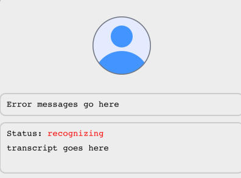

# 🎙️ expo-speech-recognition


expo-speech-recognition implements the iOS [`SFSpeechRecognizer`](https://developer.apple.com/documentation/speech/sfspeechrecognizer), Android [`SpeechRecognizer`](https://developer.android.com/reference/android/speech/SpeechRecognizer) and Web [`SpeechRecognition`](https://wicg.github.io/speech-api/) for React Native projects with the goal of code reuse across web and mobile.


## Table of Contents

- [Installation](#installation)
- [Usage](#usage)
  - [Using Hooks](#using-hooks)
  - [Permissions](#permissions)
  - [Direct module API](#direct-module-api)
- [Speech Recognition Events](#speech-recognition-events)
- [Handling Errors](#handling-errors)
  - [Advanced error handling](#advanced-error-handling)
- [Persisting Audio Recordings](#persisting-audio-recordings)
- [Transcribing audio files](#transcribing-audio-files)
  - [Supported input audio formats](#supported-input-audio-formats)
  - [File transcription example](#file-transcription-example)
- [Volume metering](#volume-metering)
  - [Volume metering example](#volume-metering-example)
- [Polyfilling the Web SpeechRecognition API](#polyfilling-the-web-speechrecognition-api)
- [Muting the beep sound on Android](#muting-the-beep-sound-on-android)
- [Improving accuracy of single-word prompts](#improving-accuracy-of-single-word-prompts)
- [Language Detection](#language-detection)
- [Platform Compatibility Table](#platform-compatibility-table)
- [Common Troubleshooting issues](#common-troubleshooting-issues)
  - [Android issues](#android-issues)
  - [iOS issues](#ios-issues)
- [API Methods](#api-methods)
  - [start()](#startoptions-speechrecognitionoptions-void)
  - [stop()](#stop-void)
  - [abort()](#abort-void)
  - [requestPermissionsAsync()](#requestpermissionsasync)
  - [requestMicrophonePermissionsAsync()](#requestmicrophonepermissionsasync)
  - [requestSpeechRecognizerPermissionsAsync()](#requestspeechrecognizerpermissionsasync)
  - [getPermissionsAsync()](#getpermissionsasync)
  - [getMicrophonePermissionsAsync()](#getmicrophonepermissionsasync)
  - [getSpeechRecognizerPermissionsAsync()](#getspeechrecognizerpermissionsasync)
  - [getStateAsync()](#getstateasync-promisespeechrecognitionstate)
  - [getSupportedLocales()](#getsupportedlocales)
  - [getSpeechRecognitionServices()](#getspeechrecognitionservices-string-android-only)
  - [getDefaultRecognitionService()](#getdefaultrecognitionservice--packagename-string--android-only)
  - [getAssistantService()](#getassistantservice--packagename-string--android-only)
  - [isRecognitionAvailable()](#isrecognitionavailable-boolean)
  - [supportsOnDeviceRecognition()](#supportsondevicerecognition-boolean)
  - [supportsRecording()](#supportsrecording-boolean)
  - [androidTriggerOfflineModelDownload()](#androidtriggerofflinemodeldownload)
  - [setCategoryIOS()](#setcategoryios-void-ios-only)
  - [getAudioSessionCategoryAndOptionsIOS()](#getaudiosessioncategoryandoptionsios-ios-only)
  - [setAudioSessionActiveIOS()](#setaudiosessionactiveiosvalue-boolean-options--notifyothersondeactivation-boolean--void)
- [System Overview Diagrams](#system-overview-diagrams)
  - [Overall Architecture](#overall-architecture)
  - [Event Flow](#event-flow)

## Installation

1. Install the package

```
npm install expo-speech-recognition

# Or for older SDKs:
npm install expo-speech-recognition@sdk-51
npm install expo-speech-recognition@sdk-50
```

2. Configure the config plugin.

> The config plugin updates the Android App Manifest to include package visibility filtering for `com.google.android.googlequicksearchbox` (Google's Speech Recognition) along with the required permissions for Android and iOS.

To configure `androidSpeechServicePackages`, add additional speech service packages here that aren't listed under the `forceQueryable` section when running the command: `adb shell dumpsys package queries`.

```js
// app.json
{
  "expo": {
    "plugins": [
      "plugin-one",
      "plugin-two",

      // no config (v0.2.22+)
      "expo-speech-recognition",

      // or with config
      [
        "expo-speech-recognition",
        {
          "microphonePermission": "Allow $(PRODUCT_NAME) to use the microphone.",
          "speechRecognitionPermission": "Allow $(PRODUCT_NAME) to use speech recognition.",
          "androidSpeechServicePackages": ["com.google.android.googlequicksearchbox"]
        }
      ]
      // rest of your plugins
    ]
  }
}
```

<details>
<summary>Important Note for Expo Beginners (click to expand)</summary>

### Important Note for Expo Beginners

If you've just created a new Expo project or have only been using the Expo SDK so far (without `ios/` and `android/` directories), you'll need to create a development build. Don't worry—this won't drastically change your workflow. For a better understanding of the differences between the React Native and Expo folder structures, check out this [video at the relevant timestamp](https://youtu.be/7J8LRpja9_o?t=611).

After completing **Step 2: Configure the config plugin**, follow these steps:

- To (re)-generate the native Android project, run:

  ```bash
  npx expo run:android
  ```

- To (re)-generate the native iOS project, run:

  ```bash
  npx expo run:ios
  ```

For more details, see [Expo's prebuild documentation](https://docs.expo.dev/workflow/prebuild/#usage-with-expo-cli-run-commands).

### Best Practices for Version Control

It's recommended by the [Expo team](https://youtu.be/7J8LRpja9_o?t=611) to add the `ios/` and `android/` directories to your `.gitignore` file and rely on **Continuous Native Generation**. This approach has its own benefits, as outlined in the [Expo documentation](https://docs.expo.dev/workflow/continuous-native-generation/).

Now, you're ready to move on to the [Usage](#usage) section.

</details>

## Usage

### Using Hooks

Using hooks is the easiest way to get started. The `useSpeechRecognitionEvent` hook allows you to register native event listeners.

```tsx
import {
  ExpoSpeechRecognitionModule,
  useSpeechRecognitionEvent,
} from "expo-speech-recognition";

function App() {
  const [recognizing, setRecognizing] = useState(false);
  const [transcript, setTranscript] = useState("");

  useSpeechRecognitionEvent("start", () => setRecognizing(true));
  useSpeechRecognitionEvent("end", () => setRecognizing(false));
  useSpeechRecognitionEvent("result", (event) => {
    setTranscript(event.results[0]?.transcript);
  });
  useSpeechRecognitionEvent("error", (event) => {
    console.log("error code:", event.error, "error message:", event.message);
  });

  const handleStart = async () => {
    const result = await ExpoSpeechRecognitionModule.requestPermissionsAsync();
    if (!result.granted) {
      console.warn("Permissions not granted", result);
      return;
    }
    // Start speech recognition
    ExpoSpeechRecognitionModule.start({
      lang: "en-US",
      interimResults: true,
      continuous: false,
    });
  };

  return (
    <View>
      {!recognizing ? (
        <Button title="Start" onPress={handleStart} />
      ) : (
        <Button
          title="Stop"
          onPress={() => ExpoSpeechRecognitionModule.stop()}
        />
      )}

      <ScrollView>
        <Text>{transcript}</Text>
      </ScrollView>
    </View>
  );
}
```

### Permissions

You should request permissions prior to starting recognition. This library exports two functions: `getPermissionsAsync` and `requestPermissionsAsync` for this purpose. If you do not request permissions or the user has denied permissions after starting, expect an `error` event with the `error` code set to `not-allowed`.

```ts
import { ExpoSpeechRecognitionModule } from "expo-speech-recognition";

ExpoSpeechRecognitionModule.getPermissionsAsync().then((result) => {
  console.log("Status:", result.status);
  console.log("Granted:", result.granted);
  console.log("Restricted:", result.restricted); // (iOS only)
  console.log("Can ask again:", result.canAskAgain);
  console.log("Expires:", result.expires);
});

ExpoSpeechRecognitionModule.requestPermissionsAsync().then((result) => {
  if (!result.granted) {
    console.warn("Permissions not granted", result);
    return;
  }
  // Permissions granted! Start speech recognition, or at some other time...
  ExpoSpeechRecognitionModule.start({ lang: "en-US" });
});
```

### Direct module API

You can also use the `ExpoSpeechRecognitionModule` to use the native APIs directly. The listener events are similar to the Web Speech API.

```ts
import { ExpoSpeechRecognitionModule } from "expo-speech-recognition";

// Register event listeners
const startListener = ExpoSpeechRecognitionModule.addListener("start", () => {
  console.log("Speech recognition started");
});

// and remove the listener when you're done:
startListener.remove();

const endListener = ExpoSpeechRecognitionModule.addListener("end", () => {
  console.log("Speech recognition ended");
});

const resultListener = ExpoSpeechRecognitionModule.addListener(
  "result",
  (event) => {
    // Note: this is not the same as the `result` event listener on the web speech API
    // event.results is an array of results (e.g. `[{ transcript: "hello", confidence: 0.5, segments: [] }]`)
    console.log("results:", event.results, "final:", event.isFinal);
  },
);

const errorListener = ExpoSpeechRecognitionModule.addListener(
  "error",
  (event) => {
    console.log("error code:", event.error, "error message:", event.message);
  },
);

// Start speech recognition
ExpoSpeechRecognitionModule.start({
  lang: "en-US",
  // Whether to return results as they become available without waiting for the final result.
  interimResults: true,
  // [Default: 5] The maximum number of alternative transcriptions to return.
  maxAlternatives: 1,
  // [Default: false] Continuous recognition.
  // If false:
  //    - on iOS 17-, recognition will run until no speech is detected for 3 seconds.
  //    - on iOS 18+ and Android, recognition will run until a final result is received.
  // Not supported on Android 12 and below.
  continuous: true,
  // [Default: false] Prevent device from sending audio over the network. Only enabled if the device supports it.
  requiresOnDeviceRecognition: false,
  // [Default: false] Include punctuation in the recognition results. This applies to full stops and commas.
  // Not supported on Android 12 and below. On Android 13+, only supported when on-device recognition is enabled.
  addsPunctuation: false,
  // [Default: undefined] Short custom phrases that are unique to your app.
  contextualStrings: ["Carlsen", "Nepomniachtchi", "Praggnanandhaa"],
  // [Default: undefined] Android-specific options to pass to the recognizer.
  androidIntentOptions: {
    EXTRA_SPEECH_INPUT_COMPLETE_SILENCE_LENGTH_MILLIS: 10000,
    EXTRA_MASK_OFFENSIVE_WORDS: false,
  },
  // [Default: undefined] The package name of the speech recognition service to use.
  androidRecognitionServicePackage: "com.google.android.tts",
  // [Default: unspecified] The type of speech recognition being performed.
  iosTaskHint: "unspecified", // "unspecified" | "dictation" | "search" | "confirmation"
  // [Default: undefined] The audio session category and options to use.
  iosCategory: {
    category: "playAndRecord",
    categoryOptions: ["defaultToSpeaker", "allowBluetooth"],
    mode: "measurement",
  },
  // [Default: false] Does extra audio processing to prevent
  // microphone feedback from speakers.
  // Note: this setting may switch the AVAudioSession mode to "voiceChat"
  // and lower the volume of speaker playback
  iosVoiceProcessingEnabled: true,
  // [Default: undefined] Recording options for Android & iOS
  // Android 13+ and iOS only.
  recordingOptions: {
    // [Default: false] Whether to persist the audio to a local file path.
    persist: false,
    // [Default: Paths.cache.uri]
    // Changes the default storage location for the audio file.
    // e.g. `Paths.document.uri` (from `expo-file-system`)
    outputDirectory: undefined,
    // [Default: `"recording_${timestamp|uuid}.[wav|caf]"`]
    // Changes the file name for the audio file.
    // (you can retrieve the file path using `event.uri` on the `audiostart`/`audioend` events)
    outputFileName: "recording.wav",
    // [Default: undefined] The sample rate of the output audio file.
    // Only supported on iOS
    // Default sample rate is: 16000 on Android, 44100/48000 on iOS
    outputSampleRate: undefined,
    // [Default: undefined] The encoding of the output audio file.
    // Only supported on iOS
    outputEncoding: undefined,
  },
  // [Default: undefined] Use for file-based transcription.
  audioSource: {
    /** Local file URI, e.g. "file:///path/to/audio.wav" */
    uri: undefined,
    // [Android only] The number of channels in the source audio.
    audioChannels: 1,
    // [Android only] A value from AudioFormat - https://developer.android.com/reference/android/media/AudioFormat
    audioEncoding: AudioEncodingAndroid.ENCODING_PCM_16BIT,
    // [Android only] Audio sampling rate in Hz.
    sampleRate: 16000,
    // [Android only] The delay between chunks of audio to stream to the speech recognition service.
    // Use this setting to avoid being rate-limited when using network-based recognition.
    // Default: 50ms for network-based recognition, 15ms for on-device recognition
    chunkDelayMillis: undefined,
  },
  // Settings for volume change events.
  volumeChangeEventOptions: {
    // [Default: false] Whether to emit the `volumechange` events when the input volume changes.
    enabled: false,
    // [Default: 100ms on iOS] The interval (in milliseconds) to emit `volumechange` events.
    intervalMillis: 300,
  },
});

// Stop capturing audio (and emit a final result if there is one)
ExpoSpeechRecognitionModule.stop();

// Immediately cancel speech recognition (does not process the final result)
ExpoSpeechRecognitionModule.abort();
```

## Speech Recognition Events

Events are largely based on the [Web Speech API](https://developer.mozilla.org/en-US/docs/Web/API/SpeechRecognition).

View the [event flow diagram here](#event-flow).

The following events are supported:

| Event Name          | Description                                                                                | Notes                                                                                                                                                                                                                                                                                    |
| ------------------- | ------------------------------------------------------------------------------------------ | ---------------------------------------------------------------------------------------------------------------------------------------------------------------------------------------------------------------------------------------------------------------------------------------- |
| `audiostart`        | Audio capturing has started                                                                | Includes the `uri` if `recordingOptions.persist` is enabled.                                                                                                                                                                                                                             |
| `audioend`          | Audio capturing has ended                                                                  | Includes the `uri` if `recordingOptions.persist` is enabled.                                                                                                                                                                                                                             |
| `end`               | Speech recognition service has disconnected.                                               | This should always be the last event dispatched, including after errors.                                                                                                                                                                                                                 |
| `error`             | Fired when a speech recognition error occurs.                                              | You'll also receive an `error` event (with code "aborted") when calling `.abort()`                                                                                                                                                                                                       |
| `nomatch`           | Speech recognition service returns a final result with no significant recognition.         | You may have non-final results recognized. This may get emitted after cancellation.                                                                                                                                                                                                      |
| `result`            | Speech recognition service returns a word or phrase has been positively recognized.        | On Android, continous mode runs as a segmented session, meaning when a final result is reached, additional partial and final results will cover a new segment separate from the previous final result. On iOS, you should expect one final result before speech recognition has stopped. |
| `speechstart`       | Fired when any sound — recognizable speech or not — has been detected                      | On iOS, this will fire once in the session after a result has occurred                                                                                                                                                                                                                   |
| `speechend`         | Fired when speech recognized by the speech recognition service has stopped being detected. | Not supported yet on iOS                                                                                                                                                                                                                                                                 |
| `start`             | Speech recognition has started                                                             | Use this event to indicate to the user when to speak.                                                                                                                                                                                                                                    |
| `volumechange`      | Fired when the input volume changes.                                                       | Returns a value between -2 and 10 indicating the volume of the input audio. Consider anything below 0 to be inaudible.                                                                                                                                                                   |
| `languagedetection` | Called when the language detection (and switching) results are available.                  | Android 14+ only with `com.google.android.as`. Enabled with `EXTRA_ENABLE_LANGUAGE_DETECTION` in the `androidIntent` option when starting. Also can be called multiple times by enabling `EXTRA_ENABLE_LANGUAGE_SWITCH`.                                                                 |

## Handling Errors

To handle errors, you can listen to the `error` event:

```ts
import {
  type ExpoSpeechRecognitionErrorCode,
  ExpoSpeechRecognitionModule,
  useSpeechRecognitionEvent,
} from "expo-speech-recognition";

ExpoSpeechRecognitionModule.addListener("error", (event) => {
  console.log("error code:", event.error, "error message:", event.message);
});

// or through the `useSpeechRecognitionEvent` hook
useSpeechRecognitionEvent("error", (event) => {
  console.log("error code:", event.error, "error message:", event.message);
});

// or through the `ExpoSpeechRecognitionErrorCode` type
const error: ExpoSpeechRecognitionErrorCode = "audio-capture";
```

The error code is based on the [Web Speech API error codes](https://developer.mozilla.org/en-US/docs/Web/API/SpeechRecognitionErrorEvent/error).

| Error Code               | Description                                                                     |
| ------------------------ | ------------------------------------------------------------------------------- |
| `aborted`                | The user called `ExpoSpeechRecognitionModule.abort()`                           |
| `audio-capture`          | Audio recording error.                                                          |
| `bad-grammar`            | Provided grammar is invalid. (Web only)                                         |
| `language-not-supported` | Locale is not supported by the speech recognizer.                               |
| `network`                | Network communication required for completing the recognition failed.           |
| `no-speech`              | No final speech was detected.                                                   |
| `not-allowed`            | Permission to use speech recognition or microphone was not granted.             |
| `service-not-allowed`    | Recognizer is unavailable.                                                      |
| `busy`                   | The recognizer is busy and cannot accept any new recognition requests.          |
| `client`                 | An unknown client-side error. Corresponds with `SpeechRecognizer.ERROR_CLIENT`. |
| `speech-timeout`         | (Android) No speech input.                                                      |
| `unknown`                | (Android) Unknown error                                                         |

### Advanced error handling

Alongside the the mapped web-speech API error name, you can also access the `error.code` field to get the platform's underlying native error code.

This is currently supported on Android only.

```ts
import {
  SpeechRecognizerErrorAndroid,
  useSpeechRecognitionEvent,
} from "expo-speech-recognition";

useSpeechRecognitionEvent("error", (event) => {
  if (event.code === SpeechRecognizerErrorAndroid.ERROR_NETWORK_TIMEOUT) {
    // do something
  }
});
```

## Persisting Audio Recordings

If you would like to persist the recognized audio for later use, you can enable the `recordingOptions.persist` option when calling `start()`. Enabling this setting will emit an `{ uri: string }` event object in the `audiostart` and `audioend` events with the local file path.

> [!IMPORTANT]
> This feature is available on Android 13+ and iOS. Call [`supportsRecording()`](#supportsrecording-boolean) to see if it's available before using this feature.

Default audio output formats:

| Platform | Output Format                             | Notes                                                                                                                               |
| -------- | ----------------------------------------- | ----------------------------------------------------------------------------------------------------------------------------------- |
| Android  | Linear PCM (16000 Hz, mono)               | Suitable for processing on various external services (such as Google Speech API, Whisper, Deepgram, etc)                            |
| iOS      | 32-bit Float PCM (44100/48000\* Hz, mono) | Default sample rate is device specific. Change this with `recordingOptions.outputSampleRate` and `recordingOptions.outputEncoding`. |

Example:

```tsx
import { Button, View } from "react-native";
import {
  ExpoSpeechRecognitionModule,
  useSpeechRecognitionEvent,
} from "expo-speech-recognition";

function RecordAudio() {
  const [recording, setRecording] = useState(false);
  const [recordingUri, setRecordingUri] = useState<string | null>(null);

  const handleStart = () => {
    setRecording(true);
    // Start recording
    ExpoSpeechRecognitionModule.start({
      lang: "en-US",
      recordingOptions: {
        persist: true,
        // Optional: Specify the output file path to save the recording to
        // e.g. `Paths.document.uri` (from `expo-file-system`)
        outputDirectory:
          "/data/user/0/expo.modules.speechrecognition.example/files",
        // Optional: Specify the output file name to save the recording to
        outputFileName: "recording.wav",
        // Optional: Specify the output sample rate to save the recording to
        // Only supported on iOS
        // Default sample rate: 16000 on Android, 44100/48000 on iOS
        outputSampleRate: 16000,
        // Optional: Specify the output encoding to save the recording to
        // Only supported on iOS
        // Default encoding: pcmFormatInt16 on Android, pcmFormatFloat32 on iOS
        outputEncoding: "pcmFormatInt16",
      },
    });
  };

  useSpeechRecognitionEvent("audiostart", (event) => {
    // Note: don't use this file until the "audioend" event is emitted
    // Note: event.uri will be null if `recordingOptions.persist` is not enabled
    console.log("Recording started for file:", event.uri);
  });

  useSpeechRecognitionEvent("audioend", (event) => {
    // Recording ended, the file is now safe to use
    console.log("Local file path:", event.uri);
    // Android: Will be saved as a .wav file
    // e.g. "file:///data/user/0/expo.modules.speechrecognition.example/cache/recording_1720678500903.wav"
    // iOS: Will be saved as a .wav file
    // e.g. "file:///path/to/Library/Caches/audio_CD5E6C6C-3D9D-4754-9188-D6FAF97D9DF2.wav"
    setRecordingPath(event.uri);
  });

  return (
    <View>
      <Button title="Start" onPress={handleStart} disabled={recording} />
      {recordingUri && <AudioPlayer source={recordingUri} />}
    </View>
  );
}

// AudioPlayer.tsx
import { Button } from "react-native";
import { useAudioPlayer } from "expo-audio";

function AudioPlayer(props: { source: string }) {
  const player = useAudioPlayer(props.source);
  return <Button title="Play" onPress={player.play} />;
}
```

## Transcribing audio files

> [!IMPORTANT]
> This feature is available on Android 13+ and iOS. If the device does not support the feature, you'll receive an `error` event with the code `audio-capture`.

Instead of using the microphone, you can configure the `audioSource.uri` option to transcribe audio files. For long-form audio files, you will likely want to use on-device recognition instead of network-based recognition which you can opt-in via `requiresOnDeviceRecognition`. For Android, you should first check if the user has the speech model installed with `getSupportedLocales()`.

### Supported input audio formats

#### Android

The following audio formats have been verified on a Samsung Galaxy S23 Ultra on Android 14:

- 16000hz 16-bit 1-channel PCM WAV ([example file](https://github.com/jamsch/expo-speech-recognition/blob/main/example/assets/audio-remote/remote-en-us-sentence-16000hz-pcm_s16le.wav))
- 16000hz MP3 1-channel ([example file](https://github.com/jamsch/expo-speech-recognition/blob/main/example/assets/audio-remote/remote-en-us-sentence-16000hz.mp3))
- 16000hz MP3 2-channel
- 16000hz ogg vorbis 1-channel ([example file](https://github.com/jamsch/expo-speech-recognition/blob/main/example/assets/audio-remote/remote-en-us-sentence-16000hz.ogg))

#### iOS

The following audio formats have been verified on an iPhone 15 Pro Max on iOS 17.5:

- 16000hz 16-bit 1-channel PCM WAV ([example file](https://github.com/jamsch/expo-speech-recognition/blob/main/example/assets/audio-remote/remote-en-us-sentence-16000hz-pcm_s16le.wav))
- 16000hz MP3 1-channel ([example file](https://github.com/jamsch/expo-speech-recognition/blob/main/example/assets/audio-remote/remote-en-us-sentence-16000hz.mp3))

### File transcription example

```tsx
import { Button, View } from "react-native";
import {
  ExpoSpeechRecognitionModule,
  useSpeechRecognitionEvent,
  AudioEncodingAndroid,
} from "expo-speech-recognition";

function TranscribeAudioFile() {
  const [transcription, setTranscription] = useState("");

  const handleTranscribe = () => {
    ExpoSpeechRecognitionModule.start({
      lang: "en-US",
      interimResults: true,
      // Recommended: true on iOS, false on Android, unless the speech model is installed, which you can check with `getSupportedLocales()`
      requiresOnDeviceRecognition: Platform.OS === "ios",
      audioSource: {
        /** Local file URI */
        uri: "file:///path/to/audio.wav",
        /** [Android only] The number of channels in the source audio. */
        audioChannels: 1,
        /** [Android only] A value from AudioFormat - https://developer.android.com/reference/android/media/AudioFormat */
        audioEncoding: AudioEncodingAndroid.ENCODING_PCM_16BIT,
        /** [Android only] Audio sampling rate in Hz. */
        sampleRate: 16000,
        /**
         * The delay between chunks of audio to stream to the speech recognition service.
         * Use this setting to avoid being rate-limited when using network-based recognition.
         * If you're using on-device recognition, you may want to increase this value to avoid unprocessed audio chunks.
         * Default: 50ms for network-based recognition, 15ms for on-device recognition
         */
        chunkDelayMillis: undefined,
      },
    });
  };

  useSpeechRecognitionEvent("result", (ev) => {
    // Note: multiple final results will likely be returned
    // so you'll need to concatenate previous final results
    setTranscription(ev.results[0]?.transcript || "");
  });

  return (
    <View>
      <Button title="Transcribe" onPress={handleTranscribe} />
      <Text>{transcription}</Text>
    </View>
  );
}
```

## Volume metering

You can use the `volumeChangeEventOptions.enabled` option to enable volume metering. This will emit a `volumechange` event with the current volume level (between -2 and 10) as a value. You can use this value to animate the volume metering of a user's voice, or to provide feedback to the user about the volume level.

### Volume metering example



See: [VolumeMeteringAvatar.tsx](https://github.com/jamsch/expo-speech-recognition/tree/main/example/components/VolumeMeteringAvatar.tsx) for a complete example that involves using `react-native-reanimated` to animate the volume metering.

```tsx
import { Button } from "react-native";
import {
  ExpoSpeechRecognitionModule,
  useSpeechRecognitionEvent,
} from "expo-speech-recognition";

function VolumeMeteringExample() {
  useSpeechRecognitionEvent("volumechange", (event) => {
    // a value between -2 and 10. <= 0 is inaudible
    console.log("Volume changed to:", event.value);
  });

  const handleStart = () => {
    ExpoSpeechRecognitionModule.start({
      lang: "en-US",
      volumeChangeEventOptions: {
        enabled: true,
        // how often you want to receive the volumechange event
        intervalMillis: 300,
      },
    });
  };

  return <Button title="Start" onPress={handleStart} />;
}
```

## Polyfilling the Web SpeechRecognition API

> [!IMPORTANT]
> This is intended for projects that rely on third party libraries that use the Web Speech API. If you're using this library directly, you should use the [Direct Module API](#direct-module-api) instead.

If you intend to polyfill the `webkitSpeechRecognition` or `SpeechRecognition` globals for use with external libraries, you can use the `ExpoWebSpeechRecognition` class to do so.

Refer to the [SpeechRecognition MDN docs](https://developer.mozilla.org/en-US/docs/Web/API/SpeechRecognition) for usage. Note that some features (such as `grammars`) on some OSes aren't yet supported.

```ts
// Import this polyfill for typings, as needed
// "npm install -D @types/dom-speech-recognition"
import "dom-speech-recognition";

import { ExpoWebSpeechRecognition } from "expo-speech-recognition";

// Polyfill the globals for use in external libraries
webkitSpeechRecognition = ExpoWebSpeechRecognition;
SpeechRecognition = ExpoWebSpeechRecognition;

// Usage is the same as the Web Speech API..
const recognition = new ExpoWebSpeechRecognition();

recognition.lang = "en-US";
// [Default: false] Note for iOS: final results are only available after speech recognition has stopped
recognition.interimResults = true;
recognition.maxAlternatives = 1;
// [Default: false] Continuous recognition. Note: if false on iOS, recognition will run until no speech is detected for 3 seconds
recognition.continuous = true;

// Custom (non-web) properties

recognition.contextualStrings = ["Carlsen", "Nepomniachtchi", "Praggnanandhaa"];
recognition.requiresOnDeviceRecognition = true;
recognition.addsPunctuation = true;
recognition.androidIntentOptions = {
  EXTRA_LANGUAGE_MODEL: "web_search",
};
recognition.androidRecognitionServicePackage = "com.google.android.tts";

// Assign an event listener (note: this overwrites all event listeners)
recognition.onstart = (event) => console.log("started!");
recognition.onend = (event) => console.log("ended!");
recognition.onresult = (event) => {
  console.log(
    "result:",
    event.results[event.resultIndex][0].transcript,
    "final:",
    event.results[event.resultIndex][0].isFinal,
  );
};

// Or register an event listener
const handleStart = (event: Event) => console.log("started!");
recognition.registerEventListener("start", handleStart);
// and remember to unregister after you're done:
recognition.removeEventListener("start", handleStart);

const handleResult = (event: SpeechRecognitionEvent) => {
  console.log("result:", event.results[event.resultIndex][0].transcript);
};

recognition.registerEventListener("result", handleResult);

recognition.registerEventListener("error", (event) => {
  console.log("error code:", event.error, "error message:", event.message);
});

recognition.registerEventListener("end", (event) => console.log("ended!"));

// Start speech recognition
recognition.start();

// Stop speech recognition
recognition.stop();

// Immediately cancel speech recognition
recognition.abort();
```

## Muting the beep sound on Android

> [!NOTE]
> This only applies to Android 13 and above.

On Android, you may notice that there's a beep sound when you start and stop speech recognition. This is due to a hardcoded behavior in the underlying SpeechRecognizer API. However, a workaround you can use is by enabling continuous recognition:

```ts
import { ExpoSpeechRecognitionModule } from "expo-speech-recognition";

ExpoSpeechRecognitionModule.start({
  lang: "en-US",
  continuous: true,
});

// Or enable recording persistence
ExpoSpeechRecognitionModule.start({
  lang: "en-US",
  recordingOptions: {
    persist: true,
  },
});
```

Under the hood, both of these set the `EXTRA_AUDIO_SOURCE` in the recognizer intent to a custom microphone source instead of using the default microphone setting.

If you intend to use the first option and still want to maintain the same behavior as non-continuous mode, you should listen for a result event with `isFinal: true` and then immediately call `abort()` to stop the recognition.

## Improving accuracy of single-word prompts

You may notice that after saying short syllables, words, letters, or numbers (e.g. "a", "b", 1, 5, etc.) that the speech recognition service may not return any results until you speak further. In order to improve the accuracy of single-word prompts for Android and iOS, you have the following options:

- For iOS, you can use the `iosTaskHint` option and set it to `confirmation`.
- For Android, the Google Development team [recommends to use the `web_search` language model for this specific issue](https://issuetracker.google.com/issues/280288200#comment28). You can change to that model (from the default `free_form`) by adding `androidIntentOptions: { EXTRA_LANGUAGE_MODEL: "web_search" }` to `ExpoSpeechRecognitionModule.start(...)`.
- For both platforms, you also may want to consider using on-device recognition. On Android this seems to work well for single-word prompts.
- Alternatively, you may want to consider recording the recognized audio and sending it to an external service for further processing. See [Persisting Audio Recordings](#persisting-audio-recordings) for more information. Note that some services (such as the Google Speech API) may require an audio file with a duration of at least 3 seconds.

## Language Detection

> [!NOTE]
> This feature is currently only available on Android 14+ using the `com.google.android.as` service package.

You can use the `languagedetection` event to get the detected language and confidence level. This feature has a few requirements:

- Android 14+ only.
- The `com.google.android.as` (on-device recognition) service package must be selected. This seems to be the only service that supports language detection as of writing this.
- You must enable `EXTRA_ENABLE_LANGUAGE_DETECTION` in the `androidIntentOptions` when starting the recognition.
- Optional: You can enable `EXTRA_ENABLE_LANGUAGE_SWITCH` to allow the user to switch languages, however **keep in mind that you need the language model to be downloaded for this to work**. Refer to [androidTriggerOfflineModelDownload()](#androidtriggerofflinemodeldownload) to download a model, and [getSupportedLocales()](#getsupportedlocales) to get the list of downloaded on-device locales.

Example:

```tsx
import { useSpeechRecognitionEvent } from "expo-speech-recognition";

useSpeechRecognitionEvent("languagedetection", (event) => {
  console.log("Language detected:", event.detectedLanguage); // e.g. "en-us"
  console.log("Confidence:", event.confidence); // A value between 0.0 and 1.0
  console.log("Top locale alternatives:", event.topLocaleAlternatives); // e.g. ["en-au", "en-gb"]
});

// Start recognition
ExpoSpeechRecognitionModule.start({
  androidIntentOptions: {
    EXTRA_ENABLE_LANGUAGE_DETECTION: true,
    EXTRA_ENABLE_LANGUAGE_SWITCH: true,
  },
  androidRecognitionServicePackage: "com.google.android.as", // or set "requiresOnDeviceRecognition" to true
});
```

## Platform Compatibility Table

As of 12 July 2025, the following platforms are supported:

### Mobile Platforms (React Native)

| Feature                             | Android 12- | Android 13 | Android 14+ | iOS 17+ | Notes                                                                           |
| ----------------------------------- | ----------- | ---------- | ----------- | ------- | ------------------------------------------------------------------------------- |
| **Basic Speech Recognition**        | ✅          | ✅         | ✅          | ✅      | Core functionality                                                              |
| **Continuous Recognition**          | ❌          | ✅         | ✅          | ✅      | Android 12- not supported                                                       |
| **Interim Results**                 | ✅          | ✅         | ✅          | ✅      | Real-time partial results                                                       |
| **On-Device Recognition**           | ❌          | ✅         | ✅          | ✅      | Requires language model download on Android                                     |
| **Audio Recording**                 | ❌          | ✅         | ✅          | ✅      | Persist audio to filesystem                                                     |
| **Audio File Transcription**        | ❌          | ✅         | ✅          | ✅      | Transcribe from a local file URI                                                |
| **Volume Metering**                 | ✅          | ✅         | ✅          | ✅      | Real-time volume levels                                                         |
| **Voice Processing**                | ❌          | ❌         | ❌          | ✅      | iOS: Prevent microphone feedback                                                |
| **Contextual Strings**              | ✅          | ✅         | ✅          | ✅      | Custom vocabulary bias. Seems to work better on iOS.                            |
| **Punctuation (`addsPunctuation`)** | ❌          | ✅ \*      | ✅ \*       | ✅      | \*Android: Only with on-device recognition                                      |
| **Language Detection**              | ❌          | ❌         | ✅ \*       | ❌      | \*Android: only with on-device recognition                                      |
| **Word Confidence & Timing**        | ❌          | ❌         | ✅ \*       | ✅      | \*Android: only with on-device recognition                                      |
| **Offensive Word Masking**          | ❌          | ✅         | ✅          | ❌      | Android 13+ with `EXTRA_MASK_OFFENSIVE_WORDS` enabled in `androidIntentOptions` |

### Web Platforms

| Platform               | Supported | Default Recognition Engine | Notes                                                                                                                                                                                                                                |
| ---------------------- | --------- | -------------------------- | ------------------------------------------------------------------------------------------------------------------------------------------------------------------------------------------------------------------------------------ |
| Android (React Native) | ✅        | Google                     | Continuous mode and Recording features are only supported on Android 13 and above. Recognition engine can be changed via `androidRecognitionServicePackage`                                                                          |
| iOS (React Native)     | ✅        | Siri                       |                                                                                                                                                                                                                                      |
| Chrome Desktop         | ✅        | Google (server-based)      | Implemented via prefix `webkitSpeechRecognition`.                                                                                                                                                                                    |
| Safari Desktop >= v16  | ✅        | Siri                       | Implemented via prefix `webkitSpeechRecognition`. Siri needs to be enabled                                                                                                                                                           |
| Chrome on Android      | ✅        | Google                     | There's a few differences in how results get handled in comparison to the Chrome Desktop implementation                                                                                                                              |
| Chrome on iOS          | ❌        | Google                     | Not working (Last tested 2023)                                                                                                                                                                                                       |
| Edge on Windows        | (unknown) | Azure                      | SpeechRecognition API is implemented, but requires the Azure speech component. Verify it's presence at `edge://components`                                                                                                           |
| Edge on Mac ARM        | ❌        | Azure                      | SpeechRecognition API is implemented, but requires the Azure speech component. Verify it's presence at `edge://components`                                                                                                           |
| Brave Desktop          | ❌        | -                          | As of July 2025, Brave is waiting for improvements to the Web Speech API for on-device recognition with no server solution (source: [brave-browser/issues/3725](https://github.com/brave/brave-browser/issues/3725#issue-421332412)) |
| Firefox Desktop        | ❌        | -                          | No SpeechRecognition implementation                                                                                                                                                                                                  |

## Common Troubleshooting Issues

### Speaker is getting picked up by the microphone

If you're experiencing feedback from the speakers, you may want to consider enabling the `iosVoiceProcessingEnabled` option when starting speech recognition. This option adds additional signal processing to your microphone and output.

### Android issues

#### Single words/letters/characters not recognized

See [Improving accuracy of single-word prompts](#improving-accuracy-of-single-word-prompts).

#### Speech recognition unavailable, not supported, or hanging

- For Android 13+, check if the device has the [Speech Recognition & Synthesis](https://play.google.com/store/apps/details?id=com.google.android.tts) (`com.google.android.tts`) package installed **and enabled**. If it was previously disabled, you may need to restart the device for the changes to take effect.
- For Android 12 and lower, check if the device has the [Google app](https://play.google.com/store/apps/details?id=com.google.android.googlequicksearchbox) (`com.google.android.googlequicksearchbox`) package installed **and enabled**.
- Use the `getSpeechRecognitionServices()` function to see what services are available on the device and `getDefaultRecognitionService()` to see which service is the default.

#### On-device recognition not working

On an Android 12 emulator, I couldn't verify whether on-device recognition works (and there's no online resources that seem to verify that it works). You'll likely see that it starts and then stops with a "error" event and the code `no-speech`.

For Android 13 and above however, you can try the following:

- Call the `getSupportedLocales()` function to see what installed locales are supported by the device. On Android 13+, you likely won't see any locales installed. If that is the case, you can call `androidTriggerOfflineModelDownload()` to download an offline model for a specific locale you want to use in order to use on-device recognition.
- If you still can't get it to work, you may want to double check if the locale is installed by opening the Android System Intelligence app (which is somewhat hidden through a few screens in the Settings app). You can navigate there through the following steps:
  `Settings -> Security and privacy -> More privacy settings -> Android System Intelligence -> On-device speech recognition`, or watch [this video](https://github.com/jamsch/expo-speech-recognition/issues/8#issuecomment-2309557322).

### iOS issues

#### Audio session issues / crashes

If you're running a multimedia application with audio or video playback, you'll need to keep in mind that this library does modify the current audio session category and mode which may cause issues. In order to work seamlessly in your application, you should make use of the following APIs:

- `getAudioSessionCategoryAndOptionsIOS()` to retrieve the current audio session category and options, you may want to use this prior to starting speech recognition
- `ExpoSpeechRecognitionModule.start({ iosCategory })` to configure the audio session category and mode when speech recognition starts
- `setAudioCategoryIOS({ category, categoryOptions, mode })` to set the audio session category and mode at a later point in time

#### Permissions issues even though the app is explicitly allowed in Settings

If the user has explicitly allowed your app **Microphone** and **Speech Recognition** permissions (under Settings > Apps > [your app]), this likely has something to do with the Speech Recognition permission.

For a quick fix, you could enable `requiresOnDeviceSpeechRecognition` so that you don't use network-based speech recognition (and therefore don't need Speech Recognition permissions). You should also switch to using the [`requestMicrophonePermissionsAsync()`](#requestmicrophonepermissionsasync) function instead, which only requests the microphone permissions instead of both microphone and speech recognition. Android doesn't have a dedicated speech recognition permission so it's safe to only request microphone permissions on both Android and iOS. Keep in mind though that the `requiresOnDeviceSpeechRecognition` setting for Android will require the language model to be installed.

However, to diagnose the underlying issue:

- Whether the user has enabled Content & Privacy Restrictions for Speech Recognition on their iOS device (Settings > Screen Time > Content & Privacy Restrictions > Speech Recognition)
  - Remedy: Add, or disable the app from the list of apps under Speech Recognition
- Whether the user is part of a Mobile device management (MDM) profile. This could make the speech recognition `restricted` (you can check for this in with the [`getPermissionsAsync()`](#getpermissionsasync) and [`requestPermissionsAsync()`](#requestpermissionsasync) APIs). To check for this, open Settings > General > VPN & Device Management.
  - Remedy: If the user is part of a managed profile, ask the MDM administrator (usually your work) to update the [Privacy Preferences Policy Control payload settings](https://support.apple.com/en-us/guide/deployment/dep38df53c2a/web) to allow your app to use speech recognition.
- As usual, after changing any of these kinds of settings in the Settings app, a reboot may just "fix" it

## API Methods

### `start(options: SpeechRecognitionOptions): void`

Starts speech recognition.

```ts
import { ExpoSpeechRecognitionModule } from "expo-speech-recognition";

ExpoSpeechRecognitionModule.start({
  lang: "en-US",
});
```

### `stop(): void`

Stops speech recognition and attempts to return a final result (through the `result` event).

```ts
ExpoSpeechRecognitionModule.stop();
// Expect the following events to be emitted in order:
// One of:
//       - A "result" event containing the final result,
//       - A "nomatch" event if the final result was empty
//      -  A "error" event with the code "no-speech" if no speech was detected
// - "audioend" indicating the end of recording
// - "end" indicating the end of speech recognition
```

### `abort(): void`

Immediately cancels speech recognition (does not process the final result).

```ts
ExpoSpeechRecognitionModule.abort();
// Expect the following events to be emitted in order:
// - "error" event with the code "aborted"
// - "end" event indicating speech recognition has finished
```

### `requestPermissionsAsync()`

Presents a dialog to the user to request the necessary permissions.

- On Android, this requests [`RECORD_AUDIO`](https://developer.android.com/reference/android/Manifest.permission#RECORD_AUDIO) permissions.
- On iOS, this requests two permissions: [`AVAudioSession.RecordPermission`](https://developer.apple.com/documentation/avfaudio/avaudiosession/recordpermission) and [`SFSpeechRecognizer.requestAuthorization()`](https://developer.apple.com/documentation/speech/sfspeechrecognizer/1649892-requestauthorization).

If you're using on-device recognition on iOS, you just need to request microphone permissions, which can be called with [`requestMicrophonePermissionsAsync()`](#requestmicrophonepermissionsasync).

Once a user has granted (or denied) permissions by responding to the original permission request dialog, the only way that the permissions can be changed is by the user themselves using the device settings app.

```ts
ExpoSpeechRecognitionModule.requestPermissionsAsync().then((result) => {
  console.log("Status:", result.status); // "granted" | "denied" | "not-determined"
  console.log("Granted:", result.granted); // true | false
  console.log("Restricted:", result.restricted); // true | false | undefined (iOS only)
  console.log("Can ask again:", result.canAskAgain); // true | false
  console.log("Expires:", result.expires); // "never" | number
});
```

### `requestMicrophonePermissionsAsync()`

Requests permissions to use the microphone.

- On iOS, this requests [`AVAudioSession.RecordPermission`](https://developer.apple.com/documentation/avfaudio/avaudiosession/recordpermission) permissions.
- On Android, this requests [`RECORD_AUDIO`](https://developer.android.com/reference/android/Manifest.permission#RECORD_AUDIO) permissions.

```ts
ExpoSpeechRecognitionModule.requestMicrophonePermissionsAsync().then(
  (result) => {
    console.log("Status:", result.status); // "granted" | "denied" | "not-determined"
    console.log("Granted:", result.granted); // true | false
    console.log("Can ask again:", result.canAskAgain); // true | false
    console.log("Expires:", result.expires); // "never" | number
  },
);
```

### `requestSpeechRecognizerPermissionsAsync()`

> [!NOTE]
> This is only supported on iOS. Request this permission only if you aren't using on-device recognition.

Requests [`SFSpeechRecognizer.requestAuthorization()`](https://developer.apple.com/documentation/speech/sfspeechrecognizer/1649892-requestauthorization) permissions before sending voice data across the network to Apple's servers for transcription.

```ts
import { Platform } from "react-native";
import { ExpoSpeechRecognitionModule } from "expo-speech-recognition";

const requiresOnDeviceRecognition = false;

// We only need this permission when network-based recognition is used on iOS
if (!requiresOnDeviceRecognition && Platform.OS === "ios") {
  ExpoSpeechRecognitionModule.requestSpeechRecognizerPermissionsAsync().then(
    (result) => {
      console.log("Status:", result.status); // "granted" | "denied" | "not-determined"
      console.log("Granted:", result.granted); // true | false
      console.log("Restricted:", result.restricted); // true | false | undefined (iOS only)
      console.log("Can ask again:", result.canAskAgain); // true | false
      console.log("Expires:", result.expires); // "never" | number
    },
  );
}
```

### `getPermissionsAsync()`

Returns the current permission status for both microphone and iOS speech recognizer.

```ts
ExpoSpeechRecognitionModule.getPermissionsAsync().then((result) => {
  console.log("Status:", result.status); // "granted" | "denied" | "not-determined"
  console.log("Granted:", result.granted); // true | false
  console.log("Restricted:", result.restricted); // true | false | undefined (iOS only)
  console.log("Can ask again:", result.canAskAgain); // true | false
  console.log("Expires:", result.expires); // "never" | number
});
```

### `getMicrophonePermissionsAsync()`

Returns the current permission status for the microphone. On Android, this checks the [`RECORD_AUDIO`](https://developer.android.com/reference/android/Manifest.permission#RECORD_AUDIO) permissions. On iOS this checks the [`AVAudioSession.RecordPermission`](https://developer.apple.com/documentation/avfaudio/avaudiosession/recordpermission) permissions.

```ts
ExpoSpeechRecognitionModule.getMicrophonePermissionsAsync().then((result) => {
  console.log("Status:", result.status); // "granted" | "denied" | "not-determined"
  console.log("Granted:", result.granted); // true | false
  console.log("Can ask again:", result.canAskAgain); // true | false
  console.log("Expires:", result.expires); // "never" | number
});
```

### `getSpeechRecognizerPermissionsAsync()`

> [!NOTE]
> This is only supported on iOS.

Checks the current permissions to use network-based recognition for [`SFSpeechRecognizer`](https://developer.apple.com/documentation/speech/sfspeechrecognizer) for iOS.

```ts
ExpoSpeechRecognitionModule.getSpeechRecognizerPermissionsAsync().then(
  (result) => {
    console.log("Status:", result.status); // "granted" | "denied" | "not-determined"
    console.log("Granted:", result.granted); // true | false
    console.log("Restricted:", result.restricted); // true | false | undefined (iOS only)
    console.log("Can ask again:", result.canAskAgain); // true | false
    console.log("Expires:", result.expires); // "never" | number
  },
);
```

### `getStateAsync(): Promise<SpeechRecognitionState>`

Returns the current internal state of the speech recognizer.

```ts
// Note: you probably should rather rely on the events emitted by the SpeechRecognition API instead
ExpoSpeechRecognitionModule.getStateAsync().then((state) => {
  console.log("Current state:", state);
  // "inactive" | "starting" | "stopping" | "recognizing"
});
```

### `getSupportedLocales()`

> [!NOTE]
> Not supported on Android 12 and below

Get the list of supported locales and the installed locales that can be used for on-device speech recognition.

```ts
ExpoSpeechRecognitionModule.getSupportedLocales({
  /**
   * The package name of the speech recognition service to use.
   * If not provided, the default service used for on-device recognition will be used.
   *
   * Warning: the service package (such as Bixby) may not be able to return any results.
   */
  androidRecognitionServicePackage: "com.google.android.as",
})
  .then((supportedLocales) => {
    console.log("Supported locales:", supportedLocales.locales.join(", "));

    // The on-device locales for the provided service package.
    // Likely will be empty if it's not "com.google.android.as"
    console.log(
      "On-device locales:",
      supportedLocales.installedLocales.join(", "),
    );
  })
  .catch((error) => {
    // If the service package is not found
    // or there was an error retrieving the supported locales
    console.error("Error getting supported locales:", error);
  });
```

### `getSpeechRecognitionServices(): string[]` (Android only)

Get list of speech recognition services available on the device.

> [!NOTE]
> This only includes services that are listed under `androidSpeechServicePackages` in your app.json as well as the core services listed under `forceQueryable` when running the command: `adb shell dumpsys package queries`

```ts
const packages = ExpoSpeechRecognitionModule.getSpeechRecognitionServices();
console.log("Speech recognition services:", packages.join(", "));
// e.g. ["com.google.android.as", "com.google.android.tts", "com.samsung.android.bixby.agent"]
```

### `getDefaultRecognitionService(): { packageName: string }` (Android only)

Returns the default voice recognition service on the device.

```ts
const service = ExpoSpeechRecognitionModule.getDefaultRecognitionService();
console.log("Default recognition service:", service.packageName);
// Usually this is "com.google.android.tts" on Android 13+ and "com.google.android.googlequicksearchbox" on Android <=12.
// For on-device recognition, "com.google.android.as" will likely be used.
```

### `getAssistantService(): { packageName: string }` (Android only)

Returns the default voice assistant service on the device.

```ts
const service = ExpoSpeechRecognitionModule.getAssistantService();
console.log("Default assistant service:", service.packageName);
// Usually "com.google.android.googlequicksearchbox" for Google
// or "com.samsung.android.bixby.agent" for Samsung
```

### `isRecognitionAvailable(): boolean`

Whether speech recognition is currently available on the device.

If this method returns false, calling `start()` will fail and emit an error event with the code `service-not-allowed` or `language-not-supported`. You should also ask the user to enable speech recognition in the system settings (i.e, for iOS to enable Siri & Dictation). On Android, you should ask the user to install and enable `com.google.android.tts` (Android 13+) or `com.google.android.googlequicksearchbox` (Android <= 12) as a default voice recognition service.

For Web, this method only checks if the browser has the Web SpeechRecognition API available, however keep in mind that browsers (like Brave) may still have the APIs but not have it implemented yet. Refer to [Platform Compatibility Table](#platform-compatibility-table) for more information. You may want to use a user agent parser to fill in the gaps.

```ts
const available = ExpoSpeechRecognitionModule.isRecognitionAvailable();
console.log("Speech recognition available:", available);
```

### `supportsOnDeviceRecognition(): boolean`

Whether the device supports on-device speech recognition.

```ts
const available = ExpoSpeechRecognitionModule.supportsOnDeviceRecognition();
console.log("OnDevice recognition available:", available);
```

### `supportsRecording(): boolean`

Whether audio recording is supported during speech recognition. This mostly applies to Android devices, to check if it's at least Android 13.

```ts
const available = ExpoSpeechRecognitionModule.supportsRecording();
console.log("Recording available:", available);
```

### `androidTriggerOfflineModelDownload()`

Users on Android devices will first need to download the offline model for the locale they want to use in order to use on-device speech recognition (i.e. the `requiresOnDeviceRecognition` setting in the `start` options).

You can see which locales are supported and installed on your device by running `getSupportedLocales()`.

To download the offline model for a specific locale, use the `androidTriggerOfflineModelDownload` function.

```ts
// Download the offline model for the specified locale
ExpoSpeechRecognitionModule.androidTriggerOfflineModelDownload({
  locale: "en-US",
})
  .then((result) => {
    switch (result.status) {
      case "opened_dialog":
        // On Android 13, the status will be "opened_dialog" indicating that the model download dialog was opened.
        console.log("Offline model download dialog opened.");
        break;
      case "download_success":
        // On Android 14+, model was succesfully downloaded.
        console.log("Offline model downloaded successfully!");
        break;
      case "download_canceled":
        // On Android 14+, the download was canceled by a user interaction.
        console.log("Offline model download was canceled.");
        break;
  })
  .catch((err) => {
    console.log("Failed to download offline model!", err.message);
  });
```

The device will display a dialog to download the model. Once the model is downloaded, you can use the `getSupportedLocales` function to get the list of installed locales.


### `setCategoryIOS({...}): void` (iOS only)

This function is an implementation of [AVAudioSession.setCategory](https://developer.apple.com/documentation/avfaudio/avaudiosession/1771734-setcategory) for iOS. For multimedia applications, you may want to set the audio session category and mode to control the audio routing.

> [!NOTE]
> When starting speech recognition, the audio session category is changed to `playAndRecord` with option `defaultToSpeaker` and `allowBluetooth` and mode `measurement`. You can instead configure the audio session category and mode by passing the `iosCategory` option to the `start(..)` function.

```ts
import {
  ExpoSpeechRecognitionModule,
  AVAudioSessionCategory,
  AVAudioSessionCategoryOptions,
  AVAudioSessionMode,
} from "expo-speech-recognition";

ExpoSpeechRecognitionModule.setCategoryIOS({
  category: AVAudioSessionCategory.playAndRecord, // or "playAndRecord"
  categoryOptions: [
    AVAudioSessionCategoryOptions.defaultToSpeaker,
    AVAudioSessionCategoryOptions.allowBluetooth,
  ],
  mode: AVAudioSessionMode.default,
});
```

### `getAudioSessionCategoryAndOptionsIOS()` (iOS only)

Returns the current audio session category and options. For advanced use cases, you may want to use this function to safely configure the audio session category and mode.

```ts
const values =
  ExpoSpeechRecognitionModule.getAudioSessionCategoryAndOptionsIOS();

console.log(values);
// { category: "playAndRecord", categoryOptions: ["defaultToSpeaker", "allowBluetooth"], mode: "measurement" }
```

### `setAudioSessionActiveIOS(value: boolean, options?: { notifyOthersOnDeactivation: boolean }): void`

Sets the audio session active state.

```ts
ExpoSpeechRecognitionModule.setAudioSessionActiveIOS(true, {
  notifyOthersOnDeactivation: true,
});
```

## System Overview Diagrams

### Overall Architecture


### Event Flow

#### Non-continuous recognition


#### Continuous recognition


